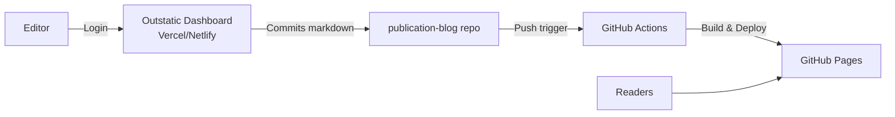

# Publication Blog - Project Context

## Overview

A static blog powered by **Outstatic CMS**, deployed to **GitHub Pages** via GitHub Actions.

## Tech Stack

| Component | Technology |
|-----------|------------|
| **Framework** | Next.js 15 (App Router) |
| **CMS** | Outstatic (headless, Git-based) |
| **Styling** | Tailwind CSS |
| **Blog Hosting** | GitHub Pages (static) |
| **CMS Dashboard** | Vercel/Netlify (for OAuth) |
| **CI/CD** | GitHub Actions |

## Architecture



## Key Decisions

- **Hybrid Deployment**: CMS dashboard hosted separately (requires OAuth callbacks)
- Content stored in `outstatic/content/` as Markdown files
- Static export for GitHub Pages hosting

## Directory Structure

```
publication-blog/
├── .context/              # AI Agent project context
│   ├── PROJECT_CONTEXT.md # This file
│   ├── GOVERNANCE.md      # AI agent rules
│   └── PROCEDURES.md      # Step-by-step procedures
├── .github/workflows/
│   └── deploy-pages.yml   # GitHub Actions workflow
├── src/app/
│   ├── page.tsx           # Blog homepage
│   ├── posts/[slug]/      # Individual post pages
│   └── outstatic/[[...ost]]/
│       └── page.tsx       # CMS dashboard route
├── outstatic/content/     # Markdown content (auto-generated)
└── next.config.ts         # Static export config
```

## Commands

| Command | Description |
|---------|-------------|
| `npm run dev` | Local development server |
| `npm run build` | Static export build (outputs to `out/`) |
| `npm run start` | Local production preview |

## Content Management

1. Editors access Outstatic dashboard at the Vercel/Netlify deployment URL
2. Content changes auto-commit to this repo
3. GitHub Actions triggers → builds static site → deploys to Pages

## Environment Variables

Required in CMS dashboard deployment (Vercel/Netlify):

| Variable | Description |
|----------|-------------|
| `OST_GITHUB_ID` | GitHub OAuth App Client ID |
| `OST_GITHUB_SECRET` | GitHub OAuth App Client Secret |
| `OST_REPO_SLUG` | `publication-blog` |
| `OST_REPO_OWNER` | `doctor500` |

---

*Last Updated: 2026-02-07*
